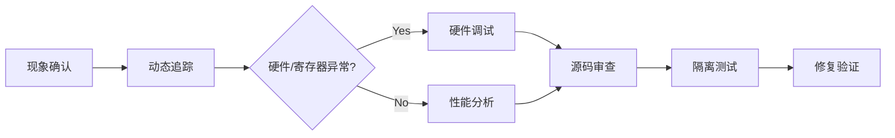

Linux内核代码在线阅读：
https://elixir.bootlin.com/linux/v2.6.11/source/kernel


page_address_maps->page_address_pool 物理页面映射到虚拟地址空间，是一个链表

page_address_htable
- list_head 
- spinlock_t 
    - slock 表示现在自旋锁的状态
    - break_lock 有进程在忙等
    spin_lock_init() 初始化自旋锁就是=1，但是有好几个宏实现

但是还是不懂这个hashtable是干啥的？
为啥要存在这个hashtable，前面不都有链表了吗？

虽然 page_address_maps 已经通过链表组织了物理页面到虚拟地址的映射关系，但链表本身在查找时可能会比较慢，尤其是在映射关系较多的情况下。为了提高查找效率，内核使用了一个哈希表 page_address_htable 来管理这些链表。
- 快速查找：通过哈希函数，可以快速定位到某个物理页面对应的 page_address_map 实例所在的槽，从而减少查找时间。
- 高效管理：哈希表可以将多个 page_address_map 实例分散到不同的槽中，避免单个链表过长，从而提高管理效率

链表查询太慢，使用hashtable加速查询


在内核编程中，物理地址和虚拟地址的映射关系是双向的，具体需要根据上下文来决定。以下是双向映射的典型场景：
3.1 高端内存映射
物理地址到虚拟地址：内核需要将高端内存页面映射到内核的虚拟地址空间中，以便访问这些页面。
虚拟地址到物理地址：当内核通过虚拟地址访问内存时，需要找到对应的物理地址，以便实际访问物理内存。
3.2 设备驱动编程
物理地址到虚拟地址：设备驱动程序需要将设备的物理地址映射到内核的虚拟地址空间中，以便可以通过虚拟地址访问设备内存。
虚拟地址到物理地址：当设备驱动程序通过虚拟地址访问设备内存时，需要找到对应的物理地址，以便实际访问设备内存。

```C
#define SPIN_LOCK_UNLOCKED (spinlock_t) { .slock = 1 SPINLOCK_MAGIC_INIT } // 初始化一个未锁定状态的自旋锁

#define spin_lock_init(x)	do { *(x) = SPIN_LOCK_UNLOCKED; } while(0)
```
上述函数的写法是啥意思

page_address_htable中的每个元素都有一个spinlock
还有一个pool的lock


在i386（32位x86架构）和x86_64（64位x86架构）体系结构中，启动加载器（Bootloader）的实现和工作方式存在一些显著的区别，这些区别主要体现在以下几个方面：

### 1. **启动模式和引导扇区**
- **i386**：
  - 通常使用传统的BIOS启动模式，引导加载器代码存储在主引导记录（MBR）中。
  - MBR位于硬盘的第一个扇区，其大小限制为512字节，这限制了引导加载器的复杂性。
- **x86_64**：
  - 支持UEFI启动模式，引导加载器可以是一个独立的`.efi`文件，存储在EFI系统分区（ESP）中。
  - UEFI提供了更大的灵活性和功能，例如支持更大的硬盘容量和更复杂的启动配置。

### 2. **引导加载器的实现**
- **i386**：
  - 常见的引导加载器是GRUB（GRand Unified Bootloader），它允许用户在启动时选择不同的操作系统或内核版本。
  - GRUB通过读取MBR中的引导记录来加载内核和初始化文件系统。
- **x86_64**：
  - GRUB2是更常用的引导加载器，它支持UEFI启动。
  - 在UEFI模式下，GRUB2可以从ESP分区加载内核和初始化文件系统，同时支持安全启动（Secure Boot）功能。

### 3. **安全启动（Secure Boot）**
- **i386**：
  - BIOS启动模式下，安全启动功能有限。
- **x86_64**：
  - UEFI支持安全启动功能，可以验证启动加载器的数字签名，确保只加载经过认证的操作系统和驱动程序。

### 4. **启动文件和配置**
- **i386**：
  - 启动加载器通常从MBR中加载，配置文件（如`grub.cfg`）存储在启动分区中。
- **x86_64**：
  - 在UEFI模式下，启动加载器文件（如`grubx64.efi`）和配置文件存储在ESP分区中。

### 5. **启动过程**
- **i386**：
  - 启动过程通常从BIOS读取MBR开始，然后执行引导加载器代码。
- **x86_64**：
  - 启动过程从UEFI固件读取ESP分区中的引导加载器文件开始。

### 总结
i386和x86_64体系结构在启动加载器的实现和工作方式上存在显著差异。i386通常使用BIOS启动模式，而x86_64支持更现代的UEFI启动模式，提供了更大的灵活性和安全性。这些差异反映了两种体系结构在启动过程中的不同需求和设计选择。

UEFI是EFI的标准化版本
有这俩就不用BIOS启动了

i386是32位x86系统，x86_64是64位的x86系统

EDD 是一种标准，用于在启动过程中提供磁盘驱动器的详细信息，包括磁盘的几何结构、支持的特性等。这个函数通常在内核启动时调用，用于将 EDD 数据从启动加载器传递给内核。


ACPI是一种标准化的接口，用于在操作系统和硬件之间进行配置和电源管理。

ACPI启动时表解析器的作用
- RSDP（Root System Description Pointer）：RSDP 是一个指针，指向根系统描述表（Root System Description Table，RSDT）或扩展系统描述表（Extended System Description Table，XSDT）。RSDP 是 ACPI 表的入口点，操作系统通过 RSDP 找到其他 ACPI 表。RSDP 的位置通常在内存的特定区域（如 BIOS 保留区域或 EFI 系统表中）。
- DT（System Description Table）：SDT 是一个描述系统硬件和软件配置的表。ACPI 定义了多种类型的描述表，如 RSDT、XSDT、FADT（Fixed ACPI Description Table）、MADT（Multiple APIC Description Table）等。
这些表提供了系统硬件的详细信息，如中断控制器、电源管理功能、硬件拓扑结构等。


### **硬件通信类问题通用排查思路**

---

#### **一、现象确认与初步诊断**
1. **基础状态检查**  
   - 确认设备是否在线（`adb devices`、`dmesg | grep uart`）。  
   - 观察系统资源占用（CPU、内存、IO），排查资源竞争或死锁（`top`、`pidstat`）。  
   - 检查内核日志（`dmesg`、`journalctl`），捕捉硬件错误或驱动异常。

2. **服务行为测试**  
   - 重启相关服务（如 `systemctl restart uartd`），观察是否卡顿或超时。  
   - 若服务卡顿，可能指向死锁、中断风暴或资源泄漏。

---

#### **二、动态追踪与链路分析**
1. **函数级追踪**  
   - 使用动态追踪工具（`bpftrace`、`ftrace`）定位关键函数调用链：  
     ```bash
     # 追踪 UART 写入函数
     bpftrace -e 'kprobe:uart_write { printf("Process: %s, Data: %s\n", comm, str(arg1)); }'
     ```
   - 关注返回值异常（如用户案例中 `uart_write` 返回 77），结合源码分析错误码含义。

2. **中断与调度分析**  
   - 监控中断触发频率，识别中断风暴：  
     ```bash
     # 统计指定中断号触发次数
     bpftrace -e 'tracepoint:irq:irq_handler_entry /args->irq == 32/ { @[kstack] = count(); }'
     ```
   - 检查中断处理函数耗时（`perf record -g -e irq:*`）。

---

#### **三、硬件/寄存器状态检查**
1. **寄存器读写验证**  
   - 通过内核调试接口或硬件工具（如 `devmem`）读取关键寄存器：  
     ```bash
     # 读取 UART 中断使能寄存器（IER）
     devmem 0x3F8+1 8  # 假设 UART 基地址为 0x3F8
     ```
   - 对比正常/异常状态寄存器值差异（如用户案例中 `IER.THRE` 异常置位）。

2. **信号完整性测试**  
   - 使用示波器或逻辑分析仪检查物理信号（如 TX/RX 线电平、时序）。  
   - 排查硬件干扰或接触不良。

---

#### **四、性能分析与热点定位**
1. **CPU 热点分析**  
   - 生成火焰图定位耗时函数：  
     ```bash
     perf record -F 99 -ag -- sleep 10
     perf script | stackcollapse-perf.pl | flamegraph.pl > hotspot.svg
     ```
   - 关注高频调用的中断处理或锁操作（如 `spin_lock`）。

2. **内存与IO瓶颈**  
   - 检查 DMA 缓冲区状态（`dmesg | grep -i dma`）。  
   - 分析内存访问延迟（`perf mem record`）。

---

#### **五、源码审查与逻辑验证**
1. **关键路径分析**  
   - 结合动态追踪结果，审查函数链路（如用户案例中的 `serial8250_start_tx()` → `serial8250_tx_chars()`）。  
   - 检查条件分支（如 `if (serial8250_set_THRI(up))`）是否因状态异常跳转。

2. **并发与锁机制**  
   - 确认共享资源（如寄存器、缓冲区）的锁保护（`spin_lock_irqsave`）。  
   - 排查死锁可能（`lockdep` 工具）。

---

#### **六、隔离测试与问题复现**
1. **环境隔离**  
   - 手动接管硬件控制（如关闭守护进程，直接 `echo` 写入设备）。  
   - 观察问题是否消失（用户案例中接管后恢复正常，指向软件栈冲突）。

2. **压力测试**  
   - 构造高负载场景（如高频数据发送），触发潜在竞态条件。  
   - 使用 `stress-ng` 或自定义脚本模拟极端情况。

---

#### **七、修复验证与预防措施**
1. **热修复验证**  
   - 修改寄存器状态或调整驱动参数（如禁用中断风暴标志）。  
   - 通过 `sysfs` 或 `debugfs` 动态应用变更。

2. **防御性编程改进**  
   - 添加状态检查（如中断使能前校验寄存器值）。  
   - 增强日志输出（`dev_dbg()` 记录关键路径状态）。

3. **监控增强**  
   - 部署持续监控（如 Prometheus 采集 UART 错误计数）。  
   - 设置告警阈值（如每秒中断次数超过 1000 触发告警）。

---

### **总结：分层递进式排查**


通过此流程，可系统化定位硬件通信类问题，平衡软件逻辑与硬件交互的排查权重，避免陷入单一维度的调试盲区。